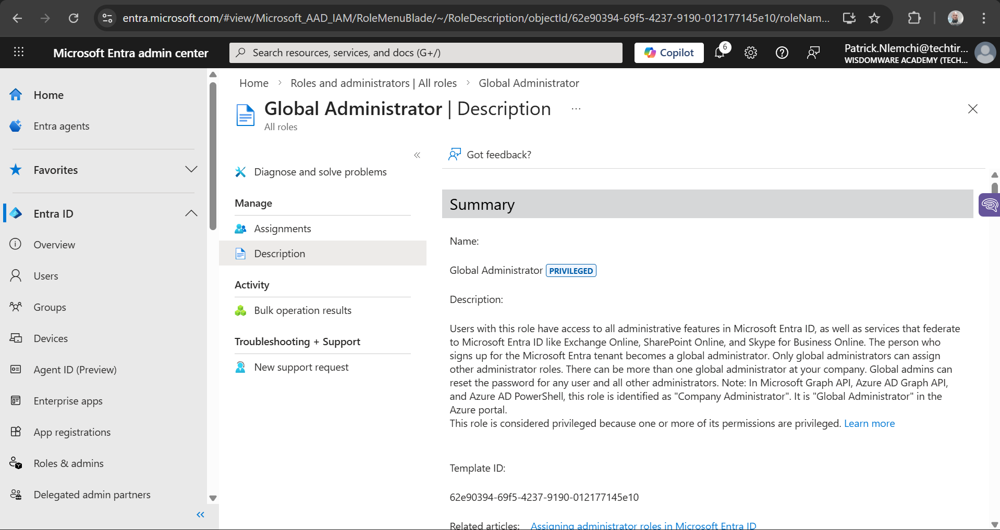

# Entra RBAC Project

## Project Overview
This repository demonstrates a structured **Role-Based Access Control (RBAC)** model for **Microsoft Entra ID (Azure AD)**.  
It showcases **access governance**, **least privilege assignments**, and **automation** using PowerShell, making it ideal for enterprise IT, healthcare, or finance environments.

---

## Access Matrix

| Role                     | Responsibilities                              | Assigned Users / Groups      | Justification                           |
|--------------------------|-----------------------------------------------|------------------------------|----------------------------------------|
| Global Administrator     | Full Entra access                             | Senior IT Lead (fictitious) | Least privilege, only when needed      |
| User Administrator       | Create/modify users                           | Helpdesk Lead               | Routine user management                |
| Helpdesk Administrator   | Reset passwords, unlock accounts              |  Helpdesk Staff              | No access to critical roles            |
| Security Reader          | View audit logs, sign-ins                     | Security Analyst            | Read-only, for monitoring              |

> 
---

## Role Assignment Screenshots

### Global Administrator – Overview


### User Administrator – Assignment


### Helpdesk Administrator – Assignment


### PowerShell Automation


---

## PowerShell Automation

The `scripts/` folder contains automation scripts:

- **`assign-roles.ps1`** – Assign roles programmatically to users/groups  
- **`list-role-members.ps1`** – List role members with DisplayName and UPN for documentation and auditing

### Example: Listing Role Members

```powershell
$Role = Get-MgDirectoryRole | Where DisplayName -eq "Helpdesk Administrator"
Get-MgDirectoryRoleMember -DirectoryRoleId $Role.Id | ForEach-Object {
    Get-MgUser -UserId $_.Id | Select DisplayName, UserPrincipalName
}
